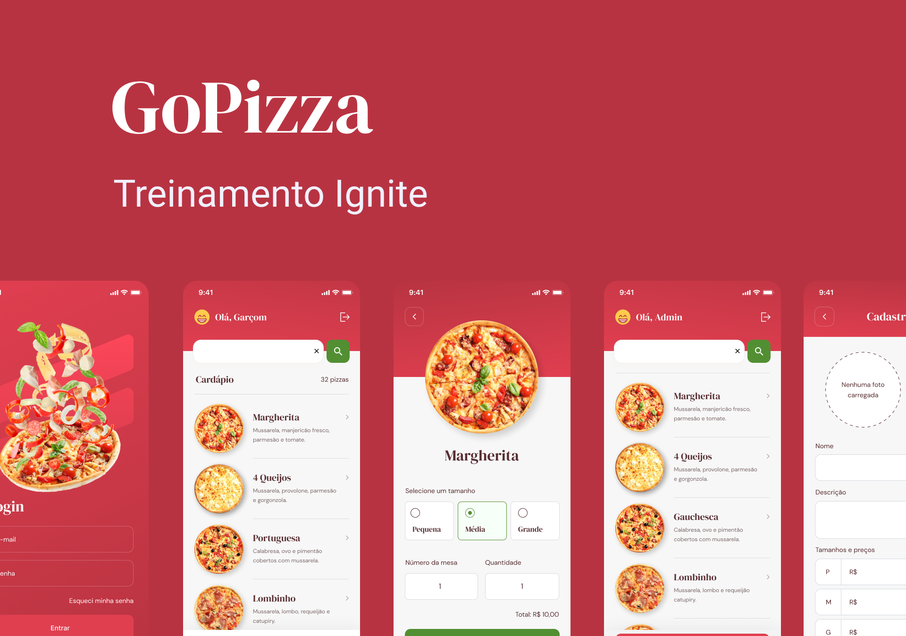

# GoPizza

\
\
Projeto base na thilha de Reac native da equipe Rocketseat o mesmo já foi desenvolvido usando [react_native](https://github.com/Santosfael/gopizza)

## 🔨 Funcionalidades da aplicação
* Admin
    * Cadastrar nova pizza
    * Alterar cadastro de pizza
    * Excluir pizza
    * Informar que a pizza está pronta (ainda será implemantado)
* Garçom
    * Fazer pedido
    * Listagem de pizzas prontas

### Tecnologias utilizadas
* Swift 5
* UIKit
* View code
* Xcode 13.4.1

## Bibliotecas instaladas

